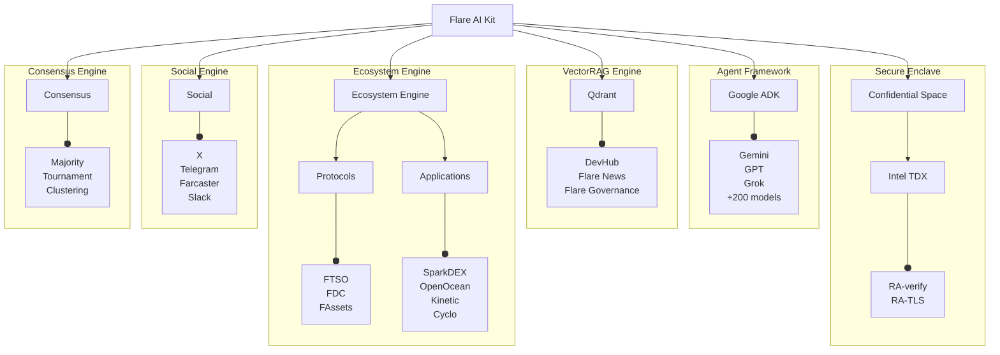

# Flare AI Kit

SDK for building **verifiable AI Agents** on Flare using Confidential Space.

> [!WARNING]
>
> Flare AI Kit is currently under active development (pre-release/alpha stage).
>
> Interfaces, APIs, and functionalities may change frequently and potentially in backward-incompatible ways before a stable release.
> Use with caution.

## ✨ Features

- **Verifiable Execution**: Run logic in hardware‑isolated TEEs - [GCP Confidential Space TDX](https://cloud.google.com/confidential-computing/confidential-space/docs/confidential-space-overview).
- **Consensus Engine**: Multi‑agent [Consensus Learning](https://arxiv.org/abs/2402.16157) via [Google Agent2Agent](https://github.com/a2aproject/A2A) protocol.
- **Strictly‑Typed Agents**: Build with [PydanticAI](https://ai.pydantic.dev) to enforce structured outputs across 200+ LLMs.
- **Flare Protocol Integration**: [FTSO](https://dev.flare.network/ftso/overview), [FDC](https://dev.flare.network/fdc/overview), [FAssets](https://dev.flare.network/fassets/overview), plus ecosystem dApps like [Sceptre](http://sceptre.fi) and [SparkDEX](https://sparkdex.ai).
- **Social Intelligence**: Analytics and connectors for X, Telegram, Farcaster.

## 🏗️ Architecture

The kit is composed of modular engines for agents, social feeds, onchain data, and consensus.



## 📦 Getting Started

**Prerequisites**

- [uv](https://github.com/astral-sh/uv) with Python >= 3.12
- [Docker](https://www.docker.com).

1. **Clone the repo:**

   ```bash
   git clone --recursive https://github.com/flare-foundation/flare-ai-kit.git
   cd flare-ai-kit
   ```

2. **Configure your environment:**

   ```bash
   # Copy the template and add your models, API keys etc.
   cp .env.example .env
   ```

3. **Install dependencies:**

   ```bash
   uv sync --all-extras
   ```

## ✅ Development Checks

Run the following commands to format, lint, type-check, and test your code before committing.

```bash
# Format, lint, and auto-fix
uv run ruff format
uv run ruff check --fix

# Run static type checking
uv run pyright

# Run tests
uv run pytest
```

## 🚧 Build with Docker

```bash
docker build -t flare-ai-kit .
docker run -rm --env-file .env flare-ai-kit
```

## ☁️ Deploy to Confidential Space

**Prerequisites:** Authenticated [gcloud CLI](https://cloud.google.com/sdk/docs/install).

1. **Configure GCP:** Set all `GCP__*` variables in your `.env` file.

2. **Deploy:**

   ```bash
   chmod +x gcloud-deploy.sh
   ./gcloud-deploy.sh # For verbose mode: ./gcloud-deploy.sh -v
   ```

## 🤝 Contributing

Contributions are highly encouraged! Please review the [CONTRIBUTING.md](CONTRIBUTING.md) guide for details on code style (Conventional Commits, Strict Typing), testing, and the PR process.

## 📜 License

This project is open-source and licensed under the Apache License 2.0. See [LICENSE](LICENSE) file.
