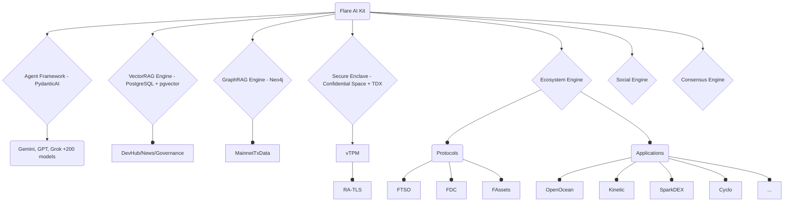

# Flare AI Kit

SDK for building **verifiable AI Agents** on Flare using Confidential Space.

> [!WARNING]
>
> Flare AI Kit is currently under active development (pre-release/alpha stage).
>
> Interfaces, APIs, and functionalities may change frequently and potentially in backward-incompatible ways before a stable release.
> Use with caution.

## ✨ Goals & Features

- **Verifiable Execution:** Run agent logic securely within Confidential Space (Intel TDX TEEs).
- **Consensus Engine:** Framework for multi-agent collaboration based on the full [Consensus Learning whitepaper](https://arxiv.org/abs/2402.16157).
- **Agent Framework:** Build type-safe agents (PydanticAI) interacting with LLMs (e.g., Gemini 2.5 Pro).
- **Flare Integration:** Connect to core protocols ([FTSO](https://dev.flare.network/ftso/overview), [FDC](https://dev.flare.network/fdc/overview), [FAssets](https://dev.flare.network/fassets/overview)) & ecosystem dApps ([Sceptre](http://sceptre.fi), [OpenOcean](https://openocean.finance), [Kinetic](https://kinetic.market) etc.).
- **Social Intelligence:** Connectors & analytics for X, Telegram, and Farcaster.

## 🏗️ Architecture Overview

Modular components include:

- Agent Framework
- Ecosystem Engine (Flare Blockchain Connectors)
- RAG Engines (Vector/Graph)
- Social Engine
- Consensus Engine
- Secure Enclave Connectors (Confidential Space)



## 📦 Getting Started

1. **Clone Repository:**

   ```bash
   git clone --recursive https://github.com/flare-foundation/flare-ai-kit.git
   cd flare-ai-kit
   ```

2. **Configure Environment:**

   Copy the example `.env` file and populate it with your specific endpoints, API keys, etc.

   ```bash
   cp .env.example .env
   ```

3. **Install Dependencies:**

   Requires Python >= 3.12 and [uv](https://github.com/astral-sh/uv).

   ```bash
   uv sync --all-extras
   ```

## ✅ Development Checks

Run the following checks locally before committing or submitting PRs:

```bash
# Format code
uv run ruff format

# Lint and auto-fix issues
uv run ruff check --fix

# Run static type checking
uv run pyright

# Run tests (ensure required env vars are set for integration tests)
uv run pytest
```

## 🤝 Contributing

Contributions are highly encouraged! Please review the [CONTRIBUTING.md](CONTRIBUTING.md) guide for details on code style (Conventional Commits, Strict Typing), testing, and the PR process.

## 📜 License

This project is open-source and licensed under the Apache License 2.0. See [LICENSE](LICENSE) file.
